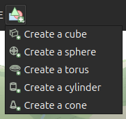
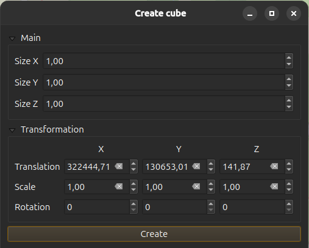
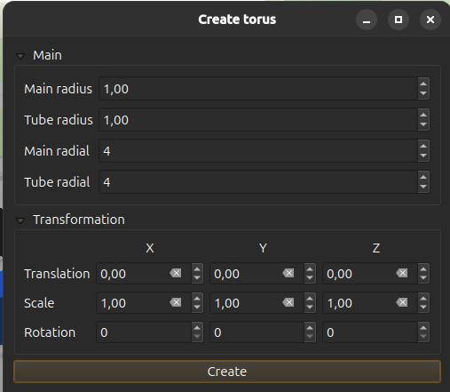
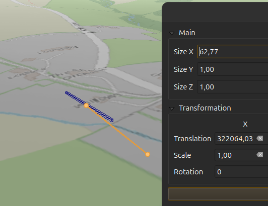
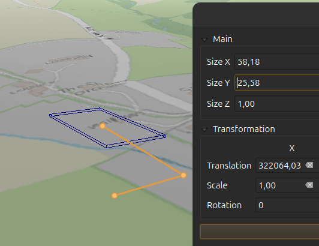
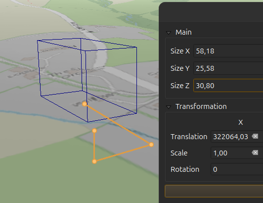
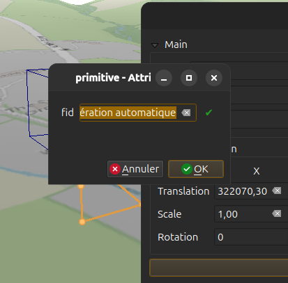

# QGIS Enhancement: Add 3D edition support

**Date** 2026/01/08

**Author** Benoit De Mezzo ([@benoitdm-oslandia](https://github.com/benoitdm-oslandia))

**Contact** benoit dot de dot mezzo at oslandia dot com

**Version** QGIS 3.X

# Summary

We like to extend QGIS by adding 3D user interface functionalities to create primitive objects (like box, sphere, torus, etc.) and to apply 3D operations (like boolean operations, copy, etc.) to existing 3D objects.

## 3D edition maptools

These new maptools will be developed within the 3D canvas beside 3D pointcloud attribute edition maptool. Four groups have been identified:

* 3D primitive creation
* 3D boolean operations (intersection, difference, union)
* 3D arrangement operations (copy n, move, rotate, scale, mirror)
* 3D modeling operations (divide, extrude, etc.)

## Proposed Solution

All these maptools will be available according to the type of the current active layer, f.e.

* you can not add a 3D primitive like a torus on a RasterLayer or a PointCloudLayer
* you will need a VectorLayer with PolyhedralSurface geometry to create 3D primitives
* you will able to copy/move/rotate any VectorLayer

Therefore when the current layer changed the maptools will be enabled/disabled according to their ability.

The new maptools will be grouped in 4 new toolbars to increase the modularity the `Qgs3DMapCanvasWidget` class. These toolbars will keep their maptools outside the `Qgs3DMapCanvasWidget` class which in return will handle a bunch of edition toolbars. To do so a new abstract class `Qgs3DEditionToolBar` will be added to help in the creation of these edition toolbars.

As the 3D pointcloud attribute edition maptools match the `Qgs3DEditionToolBar` API, it could be easily extracted from the `Qgs3DMapCanvasWidget` class into its own dedicated class.

Many of the new maptools will need the SFCGAL library to be efficient (at least v2.3.0).

### Active layer selection

For now, to select the active layer we must use the QGIS main window and select a layer within the layer browser panel. But many times when we work with a 3D view, we expand the 3D view to the whole screen to improve the navigation. At this stage to change the current active layer, we have lower the 3D view then lookup for the QGIS main window and then select a layer and at final switch back the 3D view. This is as counter productive as possible.

This could be solved by adding a layer browser within the 3D view or a drop-down selector with only the editable and VectorLayer layers.

### 3D primitive creation

3D primitives will be saved as PolyhedralSurface and a vector layer that can support this type is mandatory.

User workflow:

* select the active layer to save the new object (a QgsVectorLayer with PolyhedralSurface)
* click on the edit button of the 3D view, the 3D primitive creation toolbar is enabled

  

* click a button to create a new primitive, the maptool user input dialog is shown with default parameter values

  | Create cube | Create torus |
  | --- | --- |
  |  |  |

* first the user select the start point (this will set the X, Y and Z translation values) by clicking on the 3D canvas with the left mouse button or by input value with the keyboard
* the user can now set the value of the primitive first parameter by mouse or with the keyboard
  * when the mouse moves, a 3D rubberband is shown between the last clicked point (`prevMapPt`) and the current raycasted point on the map under the mouse (`curMapPt`). Also a temporary representation of the primitive is shown and adjusted according to the 3D distance between `prevMapPt` and `curMapPt`. The user can use the Ctrl key while moving the mouse to constraint `curMapPt` movements to an axis or a plane. The choice of the constraint axis or plane is done by the current parameter. Ie, when setting a height parameter, the constraint will be on the Z axis or when setting a cone radius, the constraint will be on the XY plane.
  * the focus is set to the parameter field of the dialog, user can set a value with the keyboard
* with left mouse button, the user can click on the 3D canvas to validate the current parameter or use the TAB key.
* the user can now set the value of the primitive next parameter.

  | Set X | Set Y | Set Z |
  | --- | --- | --- |
  |  |  |  |

* the user can unstack the previous inputs with the right mouse button or Shift-TAB key
* when the last parameter has been set, the user can adjust the parameter values in the dialog, and validate the creation dialog with the validate button or with the ENTER key.
* the feature field dialog is shown and the user can set the field values for this new feature

  

* when the user closes the dialog, the new feature is added to the layer
* as the maptool is still active the user can create a new primitive

### 3D boolean operations

We like to add the following boolean operations to the toolbar:

* intersection
* difference
* union

These operations create a new feature and share the same user workflow:

* select the active layer to save the new object (a QgsVectorLayer with PolyhedralSurface)
* click on the edit button of the 3D view, the 3D boolean operation toolbar is enabled
* click a button to select the operation maptool, the maptool user input dialog is shown
* first the user have to select at least 2 entities (can be more than 2 according to the maptool)
  * he can select them using the 2D main window by any means
  * he can select them using the 3D view by picking them on screen and with shift/Ctrl modifiers to add/remove entities from the selection
* the user can validate the operation with the validate button on the dialog or with the ENTER key.
* the feature field dialog is shown and the user can set the field values for the resulting feature
* when the user closes the dialog, the resulting feature is added to the layer
* as the maptool is still active the user can apply the same operation

### 3D arrangement operations

We like to add the following arrangement operations to the toolbar:

* move
* rotate
* scale
* mirror
* copy n

#### move, rotate, scale

These operations modify the existing features and share the same user workflow:

* select the active layer to save the new object (a QgsVectorLayer with PolyhedralSurface)
* click on the edit button of the 3D view, the 3D arrangement operation toolbar is enabled
* click a button to select the operation maptool, the maptool user input dialog is shown
* first the user have to select at least 1 entity
  * he can select them using the 2D main window by any means
  * he can select them using the 3D view by picking them on screen and with shift/Ctrl modifiers to add/remove entities from the selection
* the user can now set the value of the operation parameter by mouse or with the keyboard
  * when the mouse moves, a 3D rubberband is shown between the selection centroid (`centMapPt`) and the current raycasted point on the map under the mouse (`curMapPt`). Also a temporary representation of the operation result is shown and adjusted according to the differences between `centMapPt` and `curMapPt`. The user can use the X Y Z keys to constraint lock mouve movements to an axis or a plane. The current constraint is displayed in the dialog
  * the focus is set to the parameter field of the dialog, user can set a value with the keyboard
* the user can validate the operation with the validate button on the dialog or with the ENTER key.
* as the maptool is still active the user can apply the same operation

!!!! Example(s) !!!!!

#### mirror

There will be 3 mirrors operations: one by plane (XY, XZ, YZ).

These operations modify the existing feature and share the same user workflow:

* select the active layer to save the new object (a QgsVectorLayer with PolyhedralSurface)
* click on the edit button of the 3D view, the 3D arrangement operation toolbar is enabled
* click a button to select the operation maptool, the maptool user input dialog is shown
* first the user have to select 1 entity
  * he can select them using the 2D main window by any means
  * he can select them using the 3D view by picking it on screen and with shift/Ctrl modifiers to add/remove entities from the selection
* the user can validate the operation with the validate button on the dialog or with the ENTER key.
* as the maptool is still active the user can apply the same operation

!!!! Example(s) !!!!!

#### copy n

This operation creates a new feature, here is its user workflow:

* select the active layer to save the new object (a QgsVectorLayer with PolyhedralSurface)
* click on the edit button of the 3D view, the 3D arrangement operation toolbar is enabled
* click a button to select the operation maptool, the maptool user input dialog is shown
* first the user have to select at least 1 entity
  * he can select them using the 2D main window by any means
  * he can select them using the 3D view by picking them on screen and with shift/Ctrl modifiers to add/remove entities from the selection
* the user can now set the value of the direction parameter by mouse or with the keyboard
  * when the mouse moves, a 3D rubberband is shown between the selection centroid (`centMapPt`) and the current raycasted point on the map under the mouse (`curMapPt`). Also a temporary representation of the operation result is shown and adjusted according to the differences between `centMapPt` and `curMapPt`. The user can use the X Y Z keys to constraint lock mouve movements to an axis or a plane. The current constraint is displayed in the dialog
  * the focus is set to the parameter field of the dialog, user can set a value with the keyboard
* the user set the number of copy
* the user can validate the operation with the validate button on the dialog or with the ENTER key.
* the feature field dialog is shown and the user can set the field values for the resulting feature
* when the user closes the dialog, the resulting feature is added to the layer
* as the maptool is still active the user can apply the same operation

### 3D modeling operations

#### divide

There will be 3 mirrors operations: one by plane (XY, XZ, YZ).

These operations create 2 new features and share the same user workflow:

* select the active layer to save the new object (a QgsVectorLayer with PolyhedralSurface)
* click on the edit button of the 3D view, the 3D arrangement operation toolbar is enabled
* click a button to select the operation maptool, the maptool user input dialog is shown
* first the user have to select at least 1 entity
  * he can select them using the 2D main window by any means
  * he can select them using the 3D view by picking them on screen and with shift/Ctrl modifiers to add/remove entities from the selection
* the user can now set the plan position parameter by mouse or with the keyboard
  * when the mouse moves, a 3D rubberband is shown between the selection centroid (`centMapPt`) and the current raycasted point on the map under the mouse (`curMapPt`). Also a temporary representation of the operation result is shown and adjusted according to the differences between `centMapPt` and `curMapPt`. The user can use the X Y Z keys to constraint lock mouve movements to an axis or a plane. The current constraint is displayed in the dialog
  * the focus is set to the parameter field of the dialog, user can set a value with the keyboard
* the user can validate the operation with the validate button on the dialog or with the ENTER key.
* the feature field dialog is shown and the user can set the field values for the resulting feature
* when the user closes the dialog, the resulting feature is added to the layer
* as the maptool is still active the user can apply the same operation

#### extrude

This operation modify the existing feature and share the same user workflow:

PFFF plus d'idée là :(

* select the active layer to save the new object (a QgsVectorLayer with PolyhedralSurface)
* click on the edit button of the 3D view, the 3D arrangement operation toolbar is enabled
* click a button to select the operation maptool, the maptool user input dialog is shown
* first the user have to select 1 entity
  * he can select them using the 2D main window by any means
  * he can select them using the 3D view by picking them on screen and with shift/Ctrl modifiers to add/remove entities from the selection
* the user can now set the value of the operation parameter by mouse or with the keyboard
  * when the mouse moves, a 3D rubberband is shown between the selection centroid (`centMapPt`) and the current raycasted point on the map under the mouse (`curMapPt`). Also a temporary representation of the operation result is shown and adjusted according to the differences between `centMapPt` and `curMapPt`. The user can use the X Y Z keys to constraint lock mouve movements to an axis or a plane. The current constraint is displayed in the dialog
  * the focus is set to the parameter field of the dialog, user can set a value with the keyboard
* the user can validate the operation with the validate button on the dialog or with the ENTER key.
* as the maptool is still active the user can apply the same operation

### Affected Files

src/app/3d/qgs3dmapcanvaswidget.cpp
src/app/3d/qgs3dmapcanvaswidget.h
src/core/geometry/qgssfcgalengine.cpp
src/core/geometry/qgssfcgalengine.h
src/core/geometry/qgssfcgalgeometry.cpp
src/core/geometry/qgssfcgalgeometry.h

and all new files to handle the new maptools and toolbars.

## Risks

None

## Performance Implications

These tools will heavily use the picking via raycast and will need to often update the 3D scene. These might increase the CPU and GPU usage.

## Further Considerations/Improvements

Proper 3D snapping functionality and entity highlight will greatly benefit to these maptools.

## Backwards Compatibility

These maptools could be backported to any QGIS version with SFCGAL v2.3.0 support enabled.
